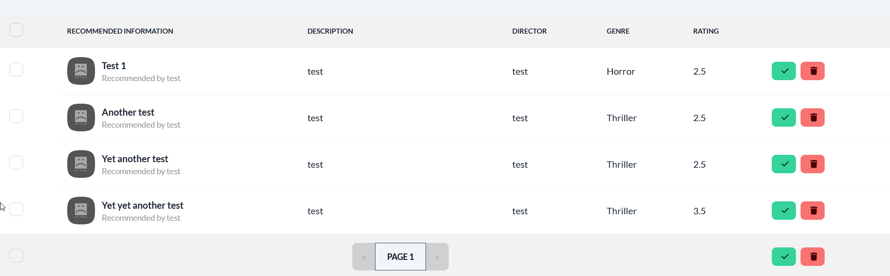

## Movie Recommendation App by Yiğit Atak

### About the project
This project is a web application that allows you to recommend movies and see the details of movies that've been suggested by the users. The application features a filter that allows you to search for movies based on genre and director, an authentication screen(this app does **NOT** have a built-in authentication system for now, it uses a fake authentication), a simple admin panel that allows you to delete and confirm recommended movies, a details page where you can see the full details of a movie, and much more. This project will likely be developed further as time goes on. Suggestions for improvement are welcome, feel free to also fork the project and work on improvements yourself if you wish. Check the to-do list down below for my current road map for this project. It utilizes an API to preserve data across multiple users and page refreshes. Currently, it doesn't utilize any DBMS so the data is lost if the API is shutdown.

### Features
1. Recommendation form

2. Login page(does **NOT** utilize actual authentication, it's a fake login page)


3. Admin panel for recommended movies, you can confirm movies to be published here or delete them.


4. You can confirm or deny multiple movies at once.

5. Admin panel supports multiple pages.

6. You can select all entries within a single page and confirm or delete them.

7. You can see all the movies that've been confirmed.

8. You can filter using a genre or a director.

9. You can see the details of a movie.


### Admin Account
The current admin account is as follows;
```
Username: test
Password: 12345

```

You can easily add your own admin account. Simply navigate to the client subfolder, then to the redux subfolder, then to the movies subfolder and open up the MoviesSlice.js file. CTRL+F and type "adminAccounts" and follow the same syntax to add a new account. **IMPORTANT!** This should NOT replace an actual user auth system in a production app.
 
### Built with
This project uses multiple libraries and frameworks.
- [React](https://tr.reactjs.org/)
- [Redux Toolkit](https://redux-toolkit.js.org/)
- [uid](https://www.npmjs.com/package/uid)
- [Tailwind CSS](https://tailwindcss.com/)
- [Daisy UI](https://daisyui.com/)
- [Axios](https://github.com/axios/axios)
- [Express](https://expressjs.com/)

### Getting Started
You need the following tools for installation:
- [NPM](https://www.npmjs.com/)

#### Installation
In order to run this project, you need to boot up both the client and the API.
1. Clone the repo.
`git clone https://github.com/Arintia/movie-recommendation.git`
2. Navigate to the newly created folder.
`cd movie-recommendation`
3. Open 2 separate terminals.
4. In terminal 1, navigate to the client subfolder.
`cd client`
5. Install dependencies for the client.
`npm i`
6. Boot the client up.
`npm start`
7. In terminal 2, navigate to the api subfolder.
`cd api`
8. Install dependencies for the API.
`npm i`
9. Boot the API up.
`node app`
10. Happy hacking!

### Usage
This proje

### Roadmap
- [ ] Better UX design.(Currently doesn't have any error messages if an operation fails.)
- [ ] Better responsive design.(Some pages aren't responsive.)
- [ ] Ability for users to rate other users' recommendations.
- [ ] Ability for users to comment on other users' recommendations.(Basic, no formatting like bold etc)
- [ ] DBMS(?), add caching if DBMS is implemented
- [ ] Better error handling.
- [ ] 404 page.
- [ ] Ability for users to give a thumbs up and thumbs down to comments.
- [ ] General testing and bug fixing.
- [ ] Add dockerfile.
- [ ] Deploy on heroku.

### Contributing
Contributions are what make the open source community such an amazing place to learn, inspire, and create. Any contributions you make are **greatly appreciated**.

If you found a bug or if you have a suggestion, feel free to fork this repo and create a pull request. Also feel free to open an issue and I'll get to it when I have time! If you want to work on your enhancement on your own, here's how you can achieve that:

1. Fork the project
2. Create a branch (`git checkout -b feature/SomeNewFeature`)
3. Commit your changes after you're done (`git commit -m "Add Some New Feature"`)
4. Push your commit (`git push origin feature/SomeNewFeature`)
5. Open a pull request
6. Wait for me to review it and merge it or suggest changes!

### License
This project is distributed under the [MIT](https://choosealicense.com/licenses/mit/) license. 

### Contact
You can connect with me on [LinkedIn](https://www.linkedin.com/in/yigitatak/)